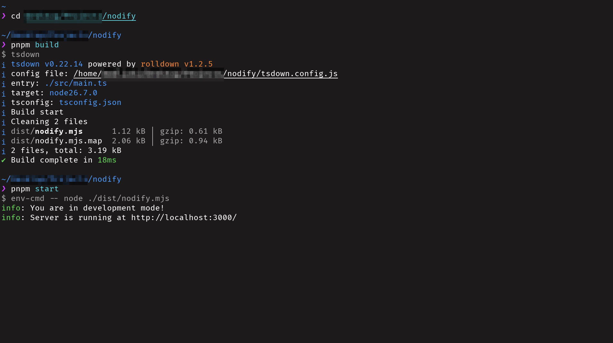
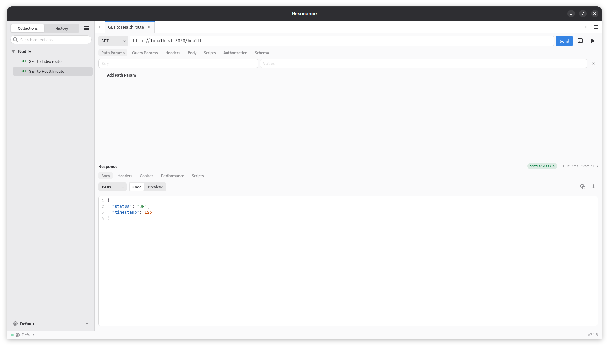

# Nodify

<div align="center">
    
    <h3 align="center">Node.js Starter Kit</h3>
</div>

## Tech Stack

<div align="center">
    
    
    
    
    
</div>

## Overview

This is a Node.js starter kit.

## Screenshots

<div align="center">
    <figure>
        
        <figcaption>The app running in <a href="https://rioterm.com/">Rio Terminal</a>.</figcaption>
    </figure>
    <figure>
        
        <figcaption>An example request to the Index route in <a href="https://github.com/matpdev/resonance/">Resonance HTTP Client</a>.</figcaption>
    </figure>
    <figure>
        
        <figcaption>An example request to the Health route in <a href="https://github.com/matpdev/resonance/">Resonance HTTP Client</a>.</figcaption>
    </figure>
</div>

## Prerequisites

Before setting up the app, make sure you have:

1. `Node.js`: a runtime environment for running the app.
2. `pnpm`: a package manager for installing dependencies.

## Installation

Follow these steps to set up the app:

1. Clone the repository:

    ```bash
    git clone https://github.com/madliani/nodify.git
    cd nodify
    ```

2. Install dependencies:

    ```bash
    pnpm install
    ```

3. Set up development mode and the app port:

    Create a `.env` file in the root directory, and add the following lines:

    ```bash
    NODE_ENV="development-or-production"
    PORT=your-port
    ```

4. Run tests:

    ```bash
    pnpm test
    ```

5. Build the app:

    ```bash
    pnpm build:release
    ```

6. Start the app:

    ```bash
    pnpm start:release
    ```

## Project Structure

- `assets/`: a directory containing assets for the `README.md` file.
    - `assets/icons/`: a directory containing icons for the `README.md` file.
        - `assets/icons/nodejs.svg`: a `Node.js` icon.
    - `assets/images/`: a directory containing images for the `README.md` file.
- `src/`: a directory containing source files of the project.
    - `src/app/`: a directory containing source files of the app.
        - `src/app/tests/`: a directory containing tests for the app.
    - `src/logger/`: a directory containing source files of the logger.
    - `src/router/`: a directory containing source files of the router.
    - `src/types/`: a directory containing type declarations for the entry point
      of the `Node.js` program.
    - `src/main.ts`: a file containing entry point of the program.
- `types/`: a directory containing type declarations for the configuration
  files.
- `.env`: an environment variables file.
- `.gitattributes`: a `Git` attributes file.
- `.gitignore`: a `Git` ignore file.
- `.prettierignore`: a `Prettier` ignore file.
- `AUTHORS.txt`: an `AUTHORS` file.
- `CHANGELOG.md`: a `CHANGELOG.md` file.
- `CONTRIBUTING.md`: a `CONTRIBUTING.md` file.
- `cspell.config.js`: a JavaScript-based `cSpell` configuration file.
- `eslint.config.js`: a JavaScript-based `ESLint` configuration file.
- `LICENSE.txt`: a license file.
- `package.json`: a `package.json` file.
- `pnpm-lock.yaml`: a `pnpm` lockfile.
- `pnpm-workspace.yaml`: a `pnpm` Workspace file.
- `prettier.config.js`: a JavaScript-based `Prettier` configuration file.
- `README.md`: a `README` file.
- `tsconfig.app.json`: a `TypeScript` configuration file for the app.
- `tsconfig.json`: a base `TypeScript` configuration file.
- `tsconfig.json`: a main `TypeScript` configuration file.
- `tsconfig.test.json`: a `TypeScript` configuration file for the tests.
- `tsdown.config.js`: a JavaScript-based `tsdown` configuration file.
- `vitest.config.js`: a JavaScript-based `Vitest` configuration file.

## Branches

- `stable`: a stable branch for production builds.
- `unstable`: an unstable branch for development and testing.

## FAQs

<details>
<summary>Under what license is the source code distributed?</summary>

The source code is distributed under the [Unlicense](./LICENSE.txt) license.

</details>

<details>
<summary>How do I start contributing to the project?</summary>

To learn about contributing to the project, see
[CONTRIBUTING.md](./CONTRIBUTING.md).

</details>

<details>
<summary>Why are some development dependencies necessary?</summary>

These dependencies are necessary for other dependencies to work correctly.

| Dependency | Purpose                              |
| ---------- | ------------------------------------ |
| tslib      | Dependency for `typescript` package. |

</details>

## Attributions

- The [Node.js](./assets/icons/nodejs.svg) icon, from
  [Icon-Icons.com](https://icon-icons.com/), created by
  [Roberto Huertas](https://icon-icons.com/authors/815-roberto-huertas/) and
  licensed under the `CC BY 4.0` license.
